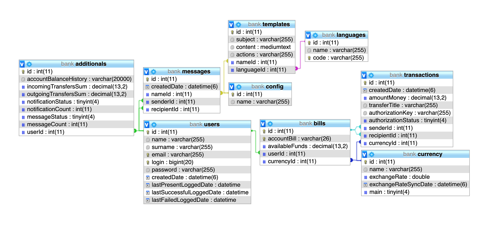

# Demo Application

Full Stack Web Application using **ReactJS+Redux** with **NodeJS (Express+TypeORM)**, **RESTful API**, **MySQL/SQLlite(demo)** 

- An application created according to the best practices used in [**react-boilerplate**](https://github.com/react-boilerplate/react-boilerplate)
- Relational model use of the **MySQL/SQLlite** database via **TypeORM**
- **Unit** & **Component Testing** using **Jest**, **Mocha**, **Chai** and [**react-testing-library**](https://github.com/testing-library/react-testing-library)

## Frontend

Technology stack:

1. **JavaScript** (ES6+)
2. **ReactJS** with **React-Router**
3. **Redux.js** with **Redux-Saga**
4. **Material UI** framework
5. **styled-components**
6. **Unit** & **Component Testing** using **Jest** and [**react-testing-library**](https://github.com/testing-library/react-testing-library)

## Backend

Technology stack:

1. **TypeScript**
2. **NodeJS** with **Express.js / AWS Serverless-Express** framework
3. **TypeORM**
4. **MySQL/SQLLite** database
5. **RESTful API** with **Basic** & **JWT Authentication**
7. **Unit Testing** using **Mocha** and **Chai**

## Requirements

- **yarn** v1.17+
- **NodeJS** v8+
- **MySQL/SQLLite** v5.6+

## Installation

for **Frontend**:

1. Clone this repository and enter the `frontend` directory
2. Install the dependencies by running `yarn`
3. Start the project by running `yarn start`

for **Backend**:

1. Clone this repository and enter the `backend` directory
2. Install the dependencies by running `yarn`
3. Start the project by running `yarn start`

**Database Model**

  

